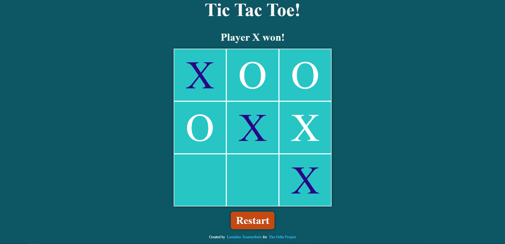

# Tic-Tac-Toe

Live Demo:
https://leo-tsant.github.io/Tic-Tac-Toe/

## Overview

This project was created for the [Tic Tac Toe assignment](https://www.theodinproject.com/lessons/node-path-javascript-tic-tac-toe) as part of [The Odin Project](https://www.theodinproject.com/). Features a web-based implementation of the classic two-player game. Built using HTML, CSS, and JavaScript, this project showcases game logic and DOM manipulation. Users can play against another player on the same device.
